Bottle filling machine (C) 2021 Kevin Groves
--------------------------------------------

I have a need to automate the filling of perfume bottles, and to help with 
my sanity during COVID lock down I thought this little project will help both.

Feel free to reuse but please do credit, hey, and if you want me to build you one
drop me a message (once lockdown is over will have better material selection). :-)

# Parts Needed

	* Any Raspberry Pi, I'm using a Zero. At some point might convert to ESP.
	* Piconzero control board (just so its all compact). https://4tronix.co.uk/blog/?p=1224
 	* HCSR04 ultasonic detector (for bottle presence detection) 
	* 3 x Microswitches (Caddy ends and bottle marker)
	* 1 x Continuous rotation servo to drive the caddy
	* 1 x Micro 180 servo to control filling pipe insertion 
	* 1 x Micro pump of choice. Using a 12v but works well under 5v it's a chemical grade so I can use with alcohol based perfumes
	* 1 x HEF4051B octal multiplexer to drive the 8 LEDS from 3 pins
	* 4 x Push buttons for the control panel
	* 8 x LEDs 
	* Any breadboard or vero to stick it all on
	* Various bits of wood, metal, whatever to build
	* 1 x Draw runner with bearings (wonderful smooth glide motion)
	* Food grade tubing for the pump

#* Wiring

  * The pump is connected to either of the motor outputs on the Piconzero
  * HCSR04 ultrasonic connects to the supplied socket for it on the Piconzero
  * The HEF requires three I/O pins to drive and these are mapped from S0-S2
    on the HEF to pins 18, 27 and 22 on the GPIO header on the Piconzero
  * The HEF is then wired up to sink each of the LEDs as:

          Pin             Where to
          1              LED 5
          2              LED 7
          3              +5V from Pi
          4              LED 8
          5              LED 6
          6              GND on Pi
          7              +5V from Pi
          8              GND on Pi
          9              GPIO 18 
          10             GPIO 27
          11             GPIO 22
          12             LED 4
          13             LED 1
          14             LED 2
          15             LED 3
          16             +5V from Pi

        All LEDs have a common ground which is connected to the Pi ground.
        5v is supplied from the Pi

    * Piconzero output pin wiring:

        0 - Caddy servo
        1 - Fill pipe servo

    * Piconzero input pin wiring:

        0 - Caddy in and Caddy out microswitches, Control panel button (unused)
        1 - Control panel button for program adjustment
        2 - Control panel program selection button
        3 - Control panel start program/emergency stop button

#* Usage

The idea is that the caddy platform provides for a replaceble jig which has custom bottle holes for
the particular bottle sizes along with a marker for where the fill point for that bottle should be.
This means that various bottle shapes and sizes can be accomodated and that they are held safely and
won't tip while in motion.

The flexible (TODO) fill pipe too provides flexiblity to position depending on size and shape.

#* Construction

The videos/pictures should show how I threw it together from the various prototypes.

Here are some early prototype videos and pictures: 

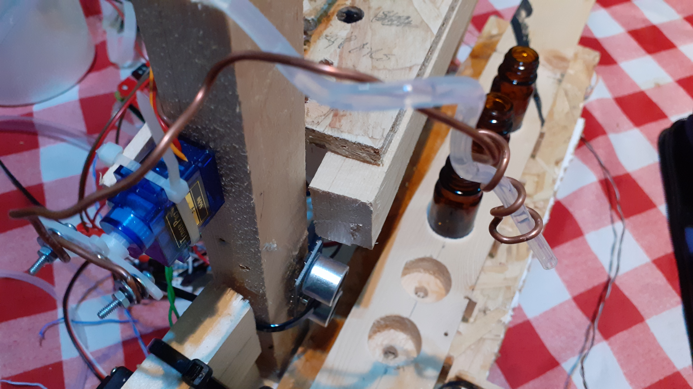
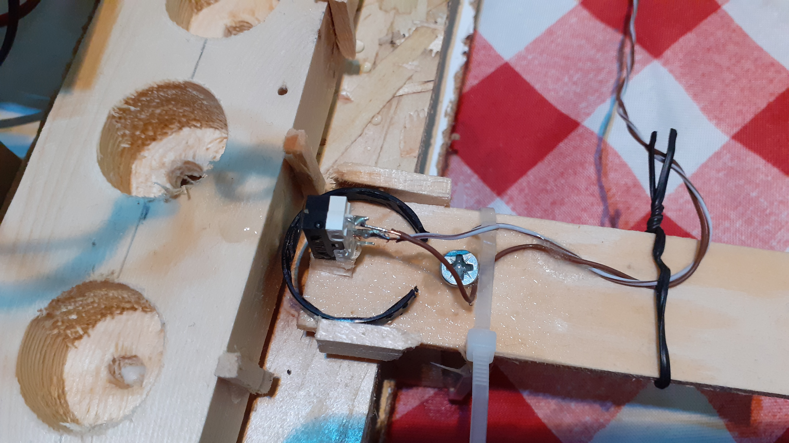  
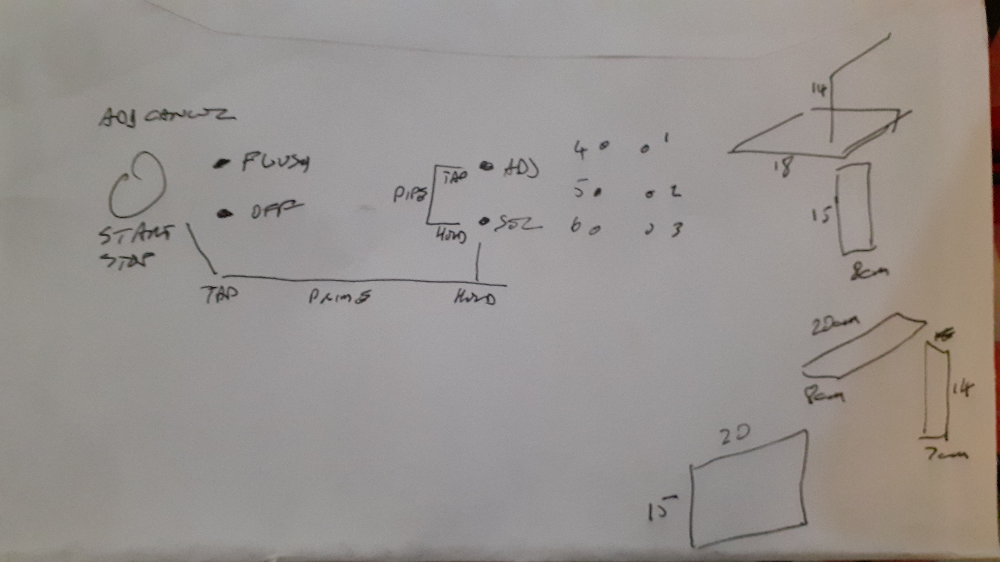  

Now some final build photos. OK, the wood quality wasn't great, due to COVID lock down I could only use materials I had at hand which was some off cut worktop and some rough ply. Annoyingly I couldn't find my decent white primer so had to use art white acryilic which didn't work so well. Oh well. Its for my 
use anyway. :-)

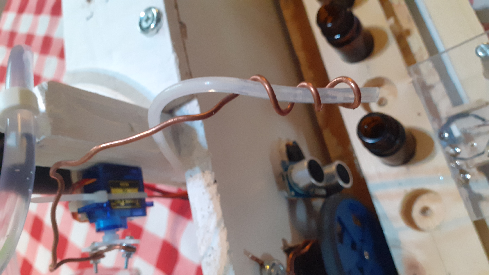  
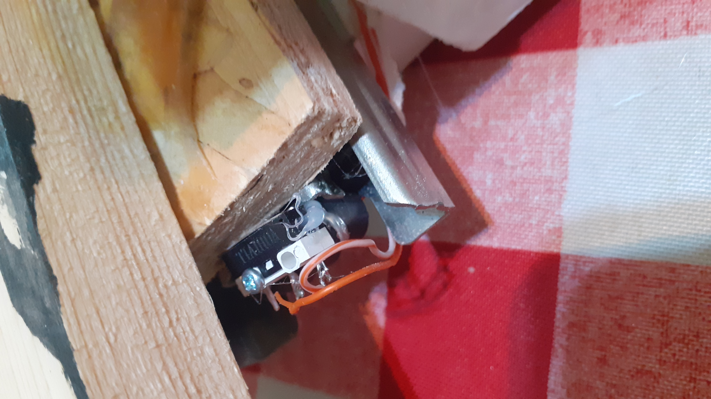
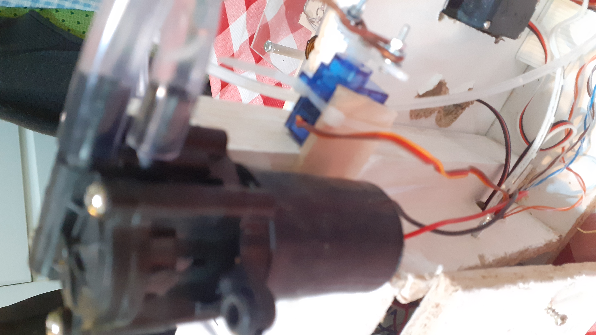  
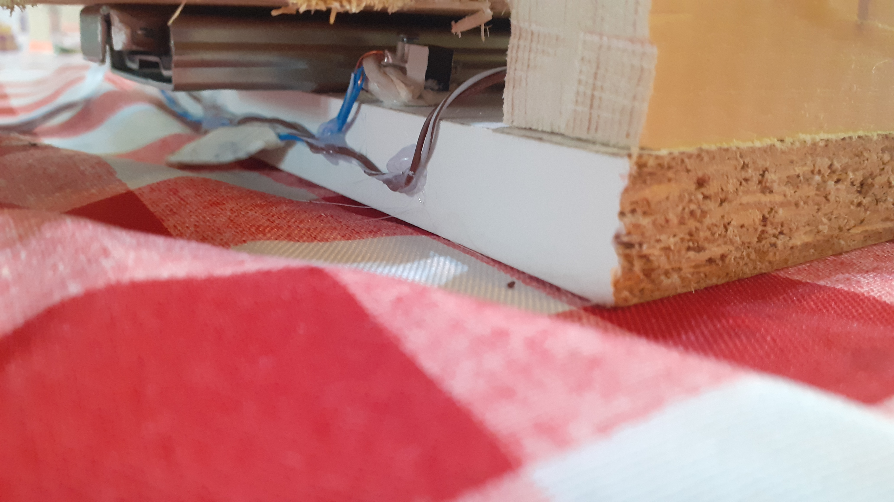
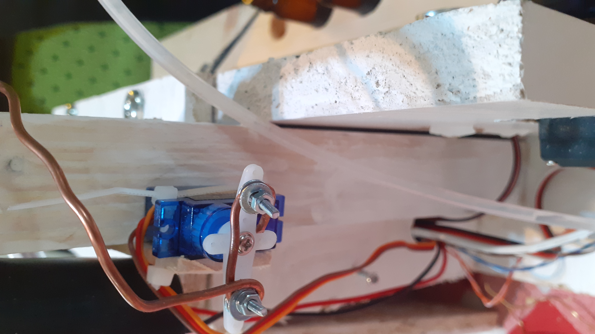  
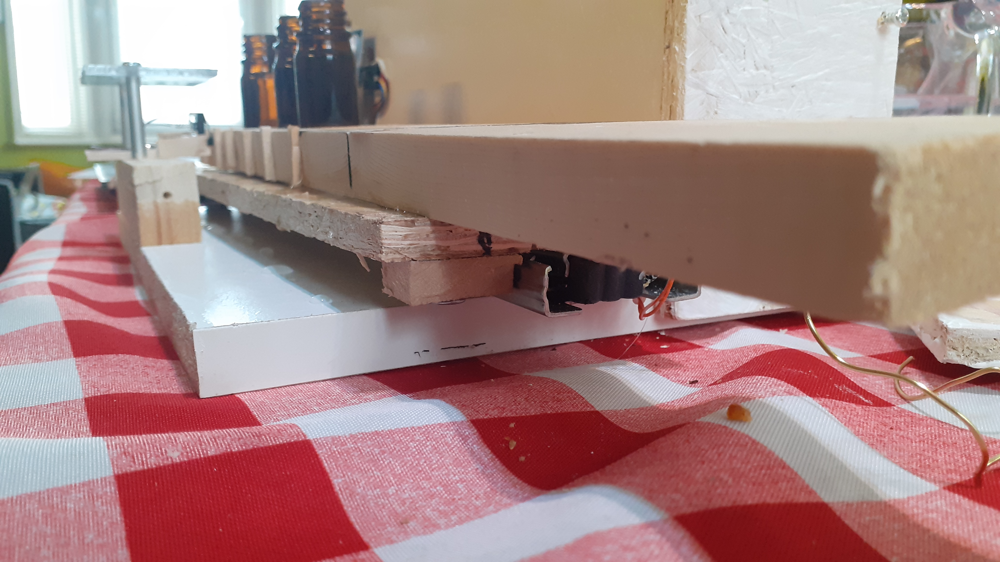
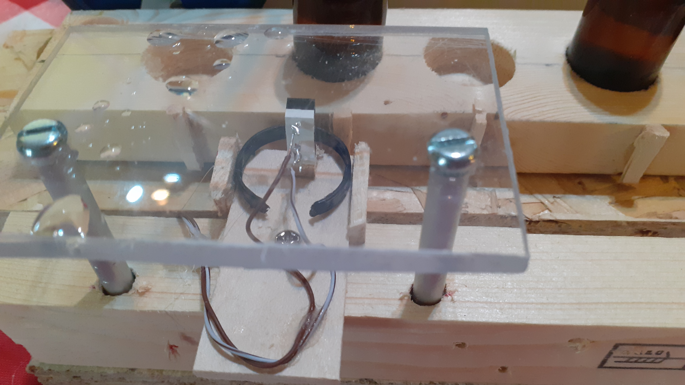 
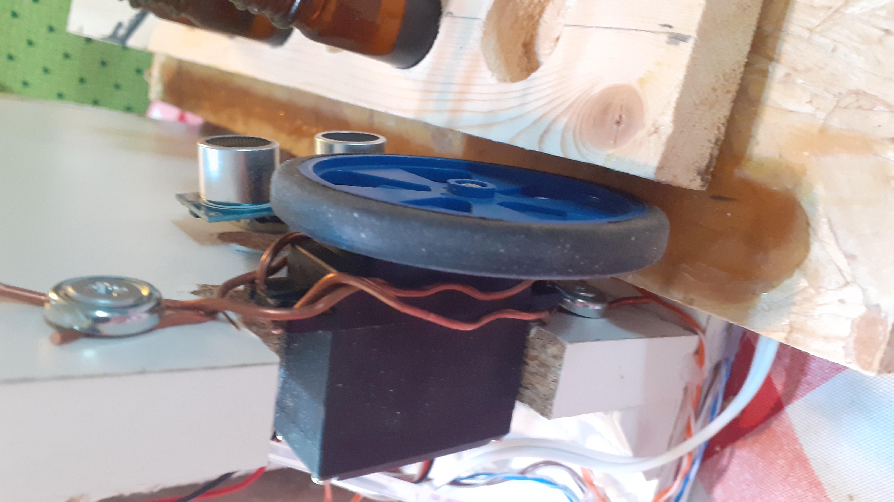
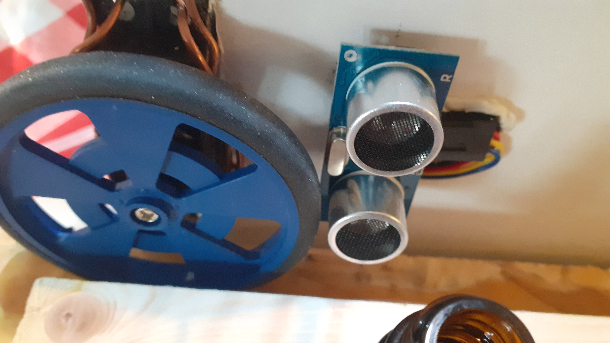  
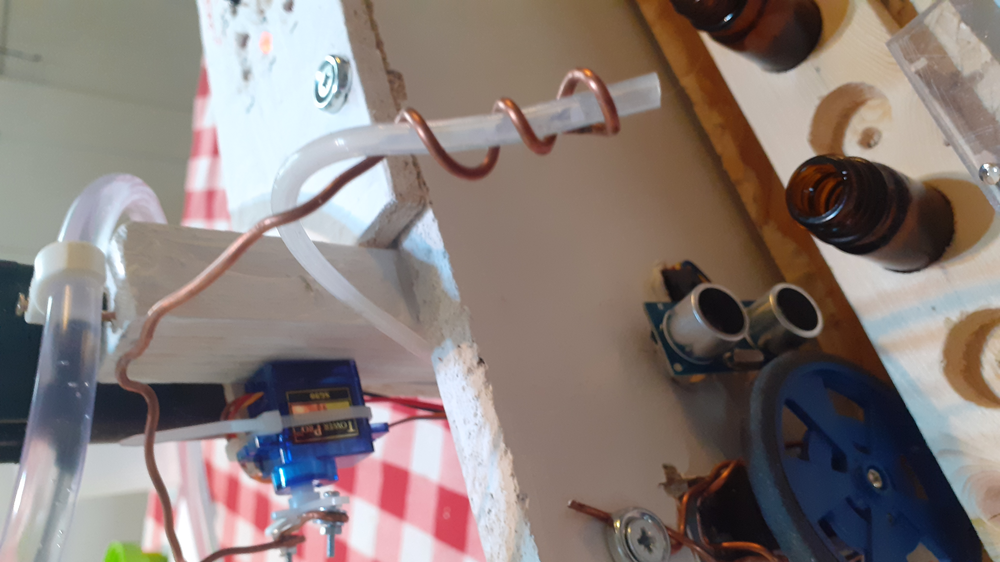

#* Control Panel Features

## Program 'Selection' button
This goes through six normal programs, the flush program (7th) that won't move the caddy and 
can be used to clean the tubing, and the 8th LED which is a system shutdown feature.

## Program Adjustment

	* Select a program to change
        * Press the 'Adjustment' button
        * The 8th and selected program LEDs will blink alternately
        * Pressing and releasing the program select button will fire the pump for one unit
        * Repeat until the desired number of presses are made
        * Pressing 'Adjustment' button will save that setting
        * Pressing 'Start' will cancel the adjustment
        * All settings are saved to 'bottle.settings' file. You can either edit it later, or 
          deletion will revert to the predefined settings in the code.

## 'Start' and emergency stop button
Starts the fill process. If at any time you need to stop before the end of program hold this button down.

## Prime Pump
If the tube is empty you need to fill the tubing with liquid so that you don't get empty bottles on the fill process. 

        * Hold down the program 'Selection' button
        * Press and hold the 'Start' button and the pump will run until you release both

## Calibrate Pipe Insert
To make sure the pipe inserts into the bottle at the right point, you can hold down the 'Selection' 
button and tap the 'Adjustment' button to toggle the position of the filling servo either in or out.
     
## Flush Program
Starting the 7th program will run the pump in whatever position it is in for a long (can be adjusted) 
cycle and this can be used to flush through any water and/or cleaning fluid.

# Fill Process

   * Press 'Selection' button until the desired program is found
   * Press 'Start' button
   * LEDs cycle
   * Caddy will eject all the bottles until the microswitch is tripped.
   * Caddy will reverse and begin to search for a bottle marker being tripped by a micro switch
   * Caddy drive servo will stop
   * Ultrasonic dector will make sure there is a bottle actually at that bottle marker
   * If a bottle is sensed then the pipe fill servo will insert the fill tube
   * Pump will start up for the required number of units
   * Pipe fill servo will remove tube
   * Caddy will then continue to look for another bottle marker unless the end caddy micro switch is
     tripped.

